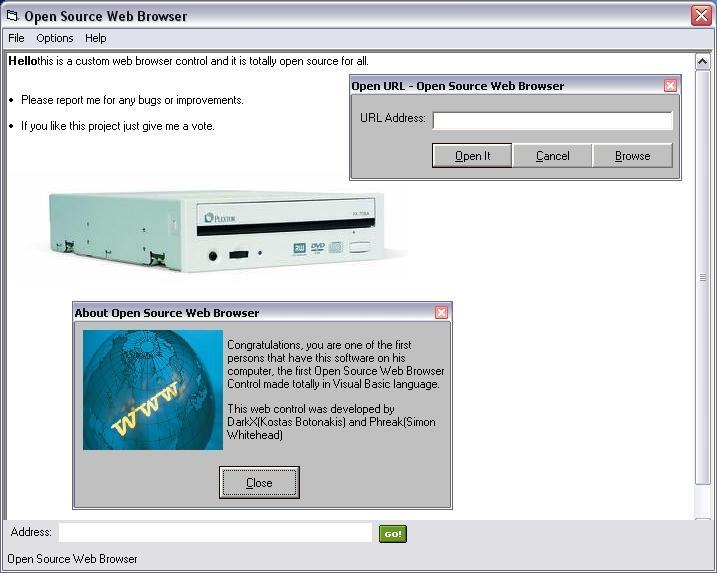



## Custom Web Browser without internet explorer's web control\.Version 1c

### Description

A custom Browser Control ready to 60%, not finished. Many tags parsing , images loader, scripts and much more.Any bugs or comments: darkx@freemail.gr

.Version:

(1b) added: More easy to use interface, Open URL dialog, some bugs fixed and i also added a screenshot of the program.

(1c) added: Some new fixes in browser's interface and fixed some bugs on loading pages!

Thanks for supporting this project to be perfect.Please don't forget to vote and report me for any bugs and improvements.
 
### More Info
 

             |
---                |---
**Submitted On**   |2004-03-07 13:48:56
**By**             |[Kostas Botonakis](https://github.com/Planet-Source-Code/PSCIndex/blob/master/ByAuthor/kostas-botonakis.md)
**Level**          |Advanced
**User Rating**    |4.0 (32 globes from 8 users)
**Compatibility**  |VB 4\.0 \(32\-bit\), VB 5\.0, VB 6\.0, VB Script
**Category**       |[Internet/ HTML](https://github.com/Planet-Source-Code/PSCIndex/blob/master/ByCategory/internet-html__1-34.md)
**World**          |[Visual Basic](https://github.com/Planet-Source-Code/PSCIndex/blob/master/ByWorld/visual-basic.md)
**Archive File**   |[Custom\_Web171754382004\.zip](https://github.com/Planet-Source-Code/kostas-botonakis-custom-web-browser-without-internet-explorer-s-web-control-version-1c__1-52167/archive/master.zip)

